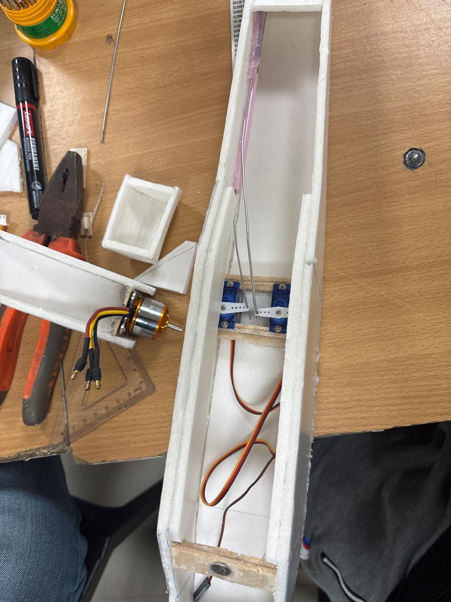
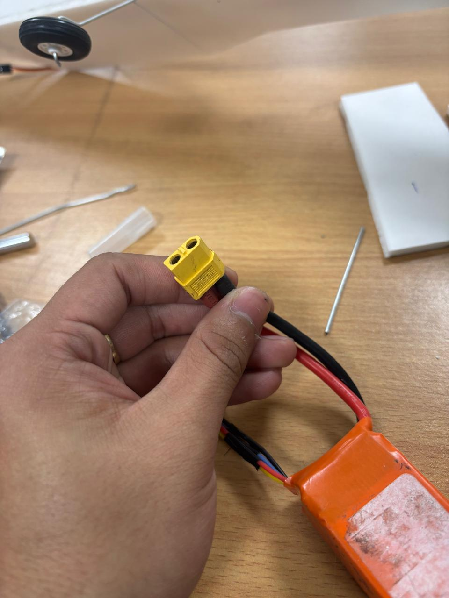
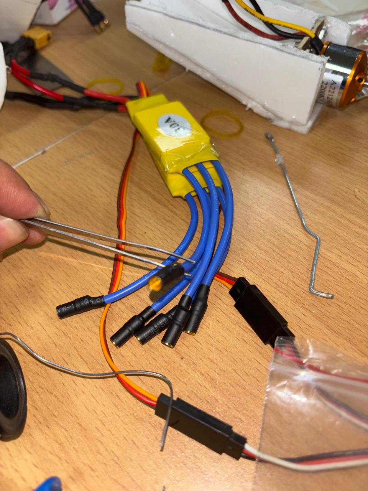

**a twin brushless-motor RC plane built from foam board — designed and sourced from self-researched references, assembled by hand.**
*didn't survive its first flight attempt. documented here anyway, because the failure taught more than a clean build would have.*

---

## 📸 build

 

<em>full set of build photos in <a href="media/">/media</a> · ground trial and crash footage to be added</em>

---

## ⚙️ components

| component | qty | role |
|:---|:---:|:---|
| Brushless Motor (twin config) | 2 | primary thrust, mounted per wing/nacelle |
| Brushless ESC, 30A | 2 | one per motor, independent speed control |
| Propeller, 6×4" | 2 | CW/CCW pair for twin-motor thrust |
| LiPo Battery, 2200mAh | 1 | main power source |
| 6-Channel Transmitter/Receiver | 1 | flight control link |
| Micro Servos | 4 | control surface actuation (ailerons, elevator, rudder) |
| Landing Gear (rod-mounted wheels) | 3 | ground support, front + 2 rear |
| Foam Board (5mm) | — | airframe material |
| Hot Glue | — | primary structural bonding |

*motor spec was researched for compatibility with the ESC/prop/battery combo before purchase, though exact model numbers weren't recorded at build time.*

---

## 🔧 how it was built

- Airframe cut and shaped from 5mm foam board, following a twin-motor layout referenced during planning
- Two brushless motors mounted on the wings, each driven by its own 30A ESC for independent control
- 4 micro servos wired for control surfaces, linked to a 6-channel transmitter/receiver setup
- Landing gear mounted on rod supports at the front and rear
- Center of gravity (CG) checked manually before flight — target position was estimated based on the wing reference, not measured with precision
- Final assembled weight: **~900g**

---

## 🪲 what happened

**🔴 front landing gear rod broke during ground testing**
the rod supporting the front wheel turned out to be too fragile for the assembled weight. it snapped before a proper ground takeoff run could happen.

**🔴 switched to hand launch — lost control shortly after**
with ground takeoff no longer possible, attempted a hand launch instead. the plane climbed a short distance, then veered hard left and became uncontrollable. it struck a net and crashed.

**🔴 root cause — inconclusive**
CG was checked beforehand but was later suspected to be inaccurate. possible contributing factors:
- weight not properly balanced (build came in at ~900g, heavier than typical reference builds for this size class)
- aerodynamic issue, possibly linked to CG or control surface setup
- motor/ESC thrust imbalance between the two sides — never confirmed, no clear sign of it, but couldn't be ruled out either since the failure happened too fast to observe closely

the airframe was damaged enough in the crash that the plane was retired rather than repaired, so the exact cause was never isolated.

---

## 🧠 what i actually learned

- a landing gear rod needs to be rated for the actual assembled weight, not just "close enough" to a reference spec
- CG has to be measured properly, not estimated — a plane this size is unforgiving of small balance errors
- twin-motor thrust needs to be symmetric, and that's worth verifying on the bench (throttle response, RPM matching) before it ever leaves the ground
- switching to a hand launch when the primary takeoff method fails is a real risk multiplier, not a simple backup plan
- documenting a failure properly (photos, video, what was checked vs. assumed) is still worth doing — it's the clearest way to know what to fix next time

---

**[Mohit Sarraf](https://github.com/mohitsarraf9198)** · project #2

